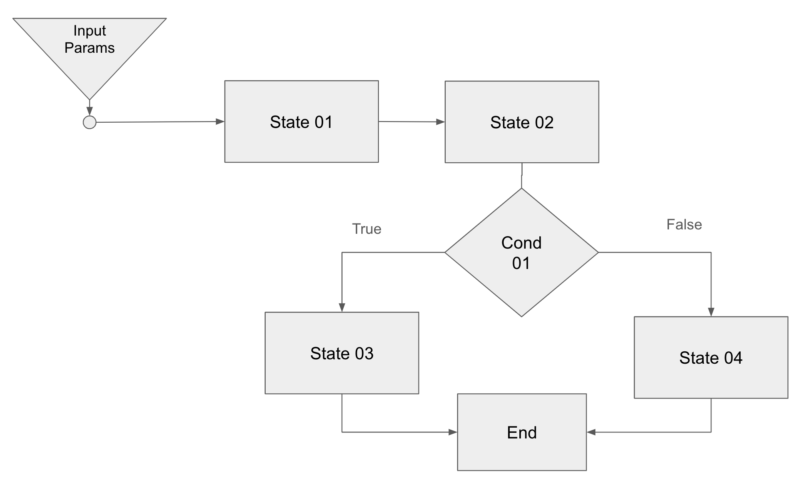

# Saga Orchestration - define and run your desired workflows

Saga Orchestration gem is inspired by Microservice Patterns by Chris Richardson. 

It provides a framework to employ the Saga Orchestration patterns described in detail in his books and articles. Secondly, it makes it easier for firms to visualize the entire flow as a set of steps.

This is available on github at: [Saga Orchestration Gem](https://github.com/jravz/saga_orchestrator)

## Description

The key goals this gem seeks to address are -
1. Enable transactions spanning singular or multiple servies to be addressed as a single, atomic operation?
2. Depict flowchart of states be depicted using a simple DSL
3. Branch to states based on conditions akin to flow charts
4. Rollback compensatory transactions in case of errors and failures. These can be mandated and hooks provided for the same
5. Visualize the sequence of steps executed as set of states ordered by sequence of operation and results at each stage

## Getting Started

### Dependencies

* Ruby 2.7 or higher

### Installing

```
gem install saga_orchestrator
```

### Executing program

#### Basic Terminology

Saga::StateEngine: Parent Class that can be inherited from to define the states within the work flow and sequence the same. 

Saga::Orchestrator - Class responsible for running the StateEngine instance and produce end result of all states.   

States - In system parlance terms, this could be a specific event like Payment Processing, New user assignment, create transaction etc. Each state can be hooked to a function with guidance on nature of function input.

Sequence - The order in which states should be executed

### How to build a workflow

To build workflows, the first step is to design the workflow. Let us take an example of a workflow as in the image below.



1. Create a child class inheriting from Saga::StateEngine
2. Add a function state_registration within the child class as below to setup all the states as below. Use register_states features to register various states.

	   def state_registration
	
	      register_states do |add_state|
	
	        add_state.standard :state_01 do |state|
	          state.call Functions::Test.method(:test_func)
	          state.params do |p|
	            p.set_type :input_params
	          end
	          state.process_output Processors::Test.method(:processor)
	        end
	
	        add_state.standard :state_02 do |state|
	          state.call Functions::Test.method(:test_func2)
	          state.params do |p|
	            p.set_type :last_result
	          end
	          state.process_input Processors::Test.method(:input_processor)
	          state.process_output Processors::Test.method(:processor)
	        end
	
	        add_state.compensatory :state_03 do |state|
	          state.call Functions::Test.method(:test_func3)
	          state.params do |p|
	            p.set_type :last_result
	          end
	          state.rollback_method do |rollback|
	            rollback.call Rollback::Test.method(:rollback2)
	            rollback.params do |p|
	              p.set_type :last_result
	            end
	          end
	          state.process_input Processors::Test.method(:input_processor)
	          state.process_output Processors::Test.method(:processor)
	        end
	
	        add_state.standard :state_04 do |state|
	          state.call Functions::Test.method(:test_func4)
	          state.params do |p|
	            p.set_type :last_result
	          end
	          state.process_input Processors::Test.method(:input_processor)
	          state.process_output Processors::Test.method(:processor)
	        end
	
	        add_state.standard :cond01 do |state|
	          state.call Functions::Test.method(:conditional_test)
	          state.params do |p|
	            p.set_type :last_result
	          end
	        end
	
	      end

    	end

### How to define a state

States can be of two types:
1. Standard - Can be hooked to a function and operates in the mode of retriable or pivot transactions
2. Compensatory - Similar to standard function. But requires an additional input of a rollback function. In the event of an error, the rollback function is called

Key parameters to define a function:
1. .call: <mandatory> -> provide the hook to any function in your project using method() as in the example above
2. .params: <mandatory> -> defines the parameter to be provided as input. Define a p.type within the block against state.params. Inputs may be of four types:
> 1. input_params: The parameters provided at the time the state engine is invoked. This is explained in the sections ahead
> 2. last_result: The result from the last state
> 3. direct: Direct inputs where an absolute set of values may be provided. 
    p.type :direct
    p.input ##input value## // can be anything example [1,2,3] or {x: 3,y: 6} etc
> 4. none: No input
3. .process_input: In case one wishes to process the input prior to passing to function, this may be added and a function hooked
4. .process_output: In case one wishes to process the output post passing to function, this may be added and a function hooked
5. .rollback_method: only available and mandatory for compensatory states. You may hook a function to perform rollback and define the parameters to pass to the function. This usually becomes the end of the workflow as a rollback is considered a fail and closure.

#### How to sequence states
One simple way to sequence states is to do nothing. If you have defined the states in the order in which they should execute and there are no conditionals, this would work well.

But if you have defined the states in any order and wish to put conditionals in the flow sequence, you can follow the steps below.
The following is an example of a function that is added to the child class to provide your own sequence

	def sequence_states
      describe_flows do |seqs|

        #this creates the first sequence with name :seq_a
        seqs.start :seq_a do |seq|
          seq.init state_name :state_01 #always add an init to start the sequence. Use state_name to invoke a particular registered state
          seq.then state_name :state_02 #to define the next state.
          seq.then_conditional state_name :cond01 do |t| #the state defined here has to provide a true or false result
            t.on_true state_name :state_03
            t.on_false state_name :state_04
          end
          seq.end #closes the sequence
        end
      end
    end

In addition to the above, you can also define a sub sequence using seqs.sub instead of seqs.start. There should be only one seqs.start as this is taken as the the point to start execution of the state engine. 
To invoke a sub sequence, replace the state_name with > sequence_name :seq_name

### How to run the state engine
If lets say, our child class is defined as Workflows::Test, you can initiate the state engine as follows:
'''

    obj = Saga::Orchestrator::new(Workflows::Test, 30, 40) #class followed by any number of input parameters. This will be referred as :input_params as explained above under definition

    obj.run() #to run the state engine. This will return result with two keys: status and result

    obj.execution_sequence # you can use this to get a hash contains each node that was run and results at each node level

'''

state can be:
1. :success - completely ran all the way to end
2. :error - in case of error in between that halted execution
3. :rollback - in case of rollback 

And that is it. You are good to go.


## Tests

I will be adding some tests soon to the same.

## Authors

Contributors names and contact info

Jayanth Ravindran
email: jayanth.ravindran@gmail.com

## Version History

* 0.1
    * Initial Release

## License

This project is licensed under the MIT License - see the MIT-LICENSE file for details

## Acknowledgments

Inspired from Chris Richardson's articles on managing transactions across services
